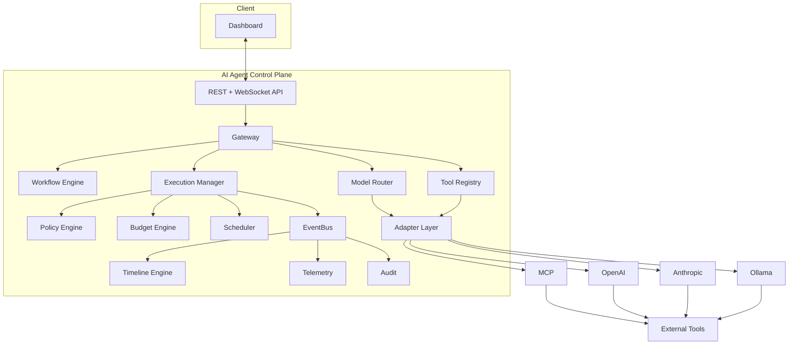

# Architecture — Milestone 1 baseline

## High-level shape

This mirrors the spec's box diagram directly; nothing here is a design
change, just a precise rendering so package boundaries can be checked
against it.

## Package-boundary decisions made during scaffolding

The spec left a few boundaries implicit. These are the calls made to
unblock Milestone 1 — flag any of them if they don't match intent, they're
cheap to change now and expensive after Milestone 5:

- **Gateway vs. Adapter Layer**: `internal/gateway` is the ingress
  boundary — inbound protocol termination, authn/authz, rate limiting —
  and calls into `internal/adapters` for provider-specific translation.
  `internal/adapters` never terminates a request itself.
- **Event store vs. message bus**: NATS (JetStream) is fan-out/delivery
  only (pub/sub to WebSocket subscribers, cross-instance coordination).
  PostgreSQL is the source of truth for the event log; anything durable
  (audit, replay) reads from Postgres, never from NATS.
- **Storage package split**: repository *interfaces* live next to the
  domain package that owns the aggregate (e.g. `internal/execution`
  defines `ExecutionRepository`). `internal/storage` holds only the
  Postgres implementations, added in Milestone 7. Earlier milestones
  develop against in-memory implementations of the same interfaces.
- **Dependency injection**: no DI framework. `internal/app` is a single
  composition root using constructor injection — see `internal/app/app.go`.
  Domain packages depend on nothing in `internal/app`; `internal/app`
  depends on all of them. This keeps domain logic unit-testable without
  a DI container and keeps "what gets wired where" in one file.
- **Config**: environment-variable driven (`internal/config`), no
  framework, since the non-functional requirement asks for env-var
  config and nothing more sophisticated is needed yet.

## Deferred to later milestones (see each package's `doc.go`)

Execution/Workflow domain model, state machine, Event envelope, Policy
evaluator, Budget tracking, Model Router, and all provider adapters are
scaffolded as empty packages with a documented responsibility and target
milestone — see `internal/*/doc.go`. This milestone does not implement
any of them; it proves the process boots, wires real infra clients
(Postgres/Redis/NATS), and serves health/readiness correctly.

## Open questions carried over from spec review (not yet resolved)

These don't block Milestone 1 but should be settled before Milestone 2–3
land, since they shape the Execution/Event schema:

1. **Replay semantics** — does "replay" re-render the stored event
   stream (safe, read-only) or re-execute from a point (which risks
   double side-effects on external tools)? Needs an explicit answer
   before the Timeline Engine (Milestone 3) API is finalized.
2. **Tool-call idempotency** — retries are a first-class concept
   (`RetryScheduled`); tool invocations need an idempotency key so a
   retried step can't double-execute a side-effecting tool call.
3. **Execution-write concurrency** — single-writer-per-execution needs
   a concrete mechanism (NATS subject keyed by execution ID, or
   Postgres optimistic locking via a version column) before Milestone 2's
   state machine is implemented.
4. **Workflow definition format** — YAML/JSON/code-first is undecided;
   blocks finishing the Workflow aggregate in Milestone 2.
5. **Approval routing** — who approves an `Approval` step and what
   happens on timeout is undefined; needed before Milestone 5.
