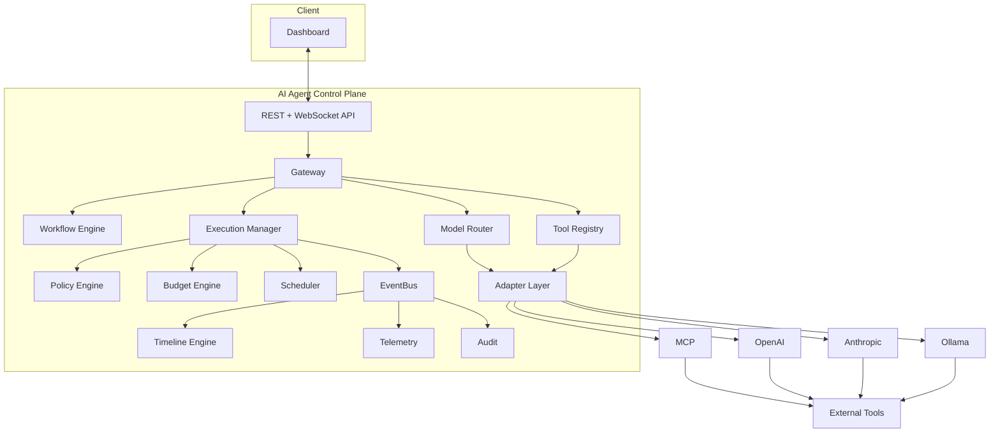
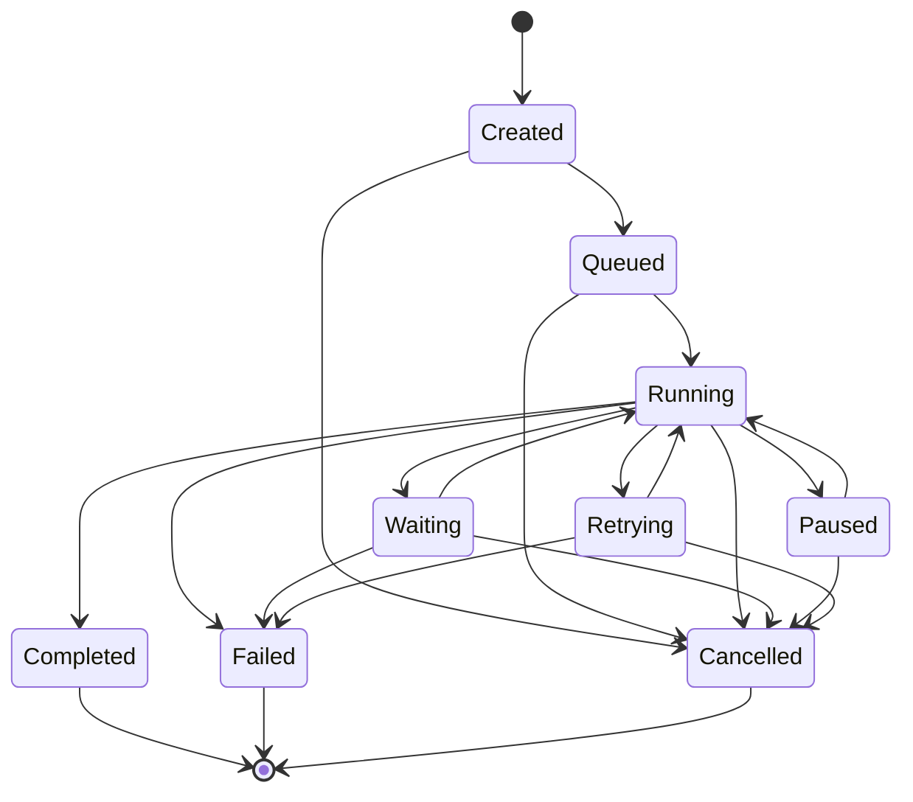

# Architecture

## High-level shape

This mirrors the spec's box diagram directly; nothing here is a design
change, just a precise rendering so package boundaries can be checked
against it.

## Package-boundary decisions made during scaffolding

The spec left a few boundaries implicit. These are the calls made to
unblock Milestone 1 — flag any of them if they don't match intent, they're
cheap to change now and expensive after Milestone 5:

- **Gateway vs. Adapter Layer**: `internal/gateway` is the ingress
  boundary — inbound protocol termination, authn/authz, rate limiting —
  and calls into `internal/adapters` for provider-specific translation.
  `internal/adapters` never terminates a request itself.
- **Event store vs. message bus**: NATS (JetStream) is fan-out/delivery
  only (pub/sub to WebSocket subscribers, cross-instance coordination).
  PostgreSQL is the source of truth for the event log; anything durable
  (audit, replay) reads from Postgres, never from NATS.
- **Storage package split**: repository *interfaces* live next to the
  domain package that owns the aggregate (e.g. `internal/execution`
  defines `ExecutionRepository`). `internal/storage` holds only the
  Postgres implementations, added in Milestone 7. Earlier milestones
  develop against in-memory implementations of the same interfaces.
- **Dependency injection**: no DI framework. `internal/app` is a single
  composition root using constructor injection — see `internal/app/app.go`.
  Domain packages depend on nothing in `internal/app`; `internal/app`
  depends on all of them. This keeps domain logic unit-testable without
  a DI container and keeps "what gets wired where" in one file.
- **Config**: environment-variable driven (`internal/config`), no
  framework, since the non-functional requirement asks for env-var
  config and nothing more sophisticated is needed yet.

## Deferred to later milestones (see each package's doc comment)

Gateway, Policy evaluator, Budget tracking, Event envelope/bus, Timeline
projection, Model Router, and all provider adapters are still empty
packages with a documented responsibility and target milestone — see
the package comment at the top of each `internal/*` package's main file.
Execution and Workflow (below) are no longer in that category.

## Milestone 2 — core domain model and state machine

`internal/workflow` and `internal/execution` are implemented. Key
decisions made to unblock this milestone, resolving two of the open
questions below:

- **Workflow definition format** (was open question #4): canonical
  in-memory representation is the `Workflow`/`Step` Go structs, with
  `json` tags for API request/response bodies. YAML is left as a thin
  conversion layer to add later (unmarshal YAML → JSON → the same
  struct) rather than a distinct format designed around now — this
  keeps the REST API (Milestone 5) trivial and doesn't invent a DSL
  before there's evidence one is needed.
- **Make illegal states unrepresentable**: `workflow.New` fully
  validates the step graph (unique IDs, resolvable dependencies, no
  cycles — detected via Kahn's algorithm) and caches a topological
  order at construction time. There is no separate `Validate()` a
  caller can forget to call; a `Workflow` value cannot exist in an
  invalid state.
- **Execution aggregate stays narrow**: `Execution` owns exactly
  lifecycle `State` and per-step `StepRun` progress. Budget ledger
  entries, policy decisions, and events reference an execution ID from
  their own owning packages rather than being embedded as fields here —
  "everything belongs to an execution" is a relationship, not a struct
  embedding. This avoids guessing at shapes (`internal/budget`,
  `internal/policy`, `internal/events`) that don't exist yet.
- **Repository pattern, in-memory today**: both packages define a
  `Repository` interface plus an `InMemoryRepository`, per the
  Milestone 1 decision that repository interfaces live next to their
  domain package and the Postgres implementation is a Milestone 7
  swap-in. `execution.InMemoryRepository` deliberately returns/stores
  **clones** (`Execution.Clone()`) rather than shared pointers, so code
  written against it can't rely on aliasing that won't hold once
  Milestone 7 swaps in Postgres — `Get()` gives you a snapshot; only
  `Update()` persists a change. This is the resolution (for the
  in-memory case) of open question #3 below on write concurrency: it
  doesn't provide cross-instance concurrency control, but it does
  enforce the same "read a copy, write explicitly" discipline the real
  implementation will need, so calling code is already written correctly
  against it.

### Execution state machine

The spec's own diagram renders the nine states as a single straight
line (`Retrying -> Completed -> Failed -> Cancelled`), which taken
literally would mean every execution retries, then completes, then
fails, then gets cancelled. Read in context it's clearly just an
enumeration of the state names, not a transition graph. The actual
graph implemented in `internal/execution/state.go`:

Nothing generates this diagram from the code (or vice versa) — keep
them in sync by hand if the graph changes; `state.go`'s `transitions`
map is the authoritative source. `Completed`, `Failed`, and `Cancelled`
are terminal: `Execution.Transition` rejects any further transition
once one of those is reached, regardless of target.

Step-level progress (`StepRun.Status`) is intentionally a lighter
model: pending/running/waiting/completed/failed/skipped with only a
single rule enforced (a terminal step can't be modified further). It
does not have its own transition graph, and it does not decide *which*
step runs next based on the Workflow's dependency graph — that
ordering/dispatch logic belongs to the Scheduler / Execution Manager
(Milestone 5+), not to this aggregate.

## Milestone 3 — event bus and timeline engine

`internal/events` and `internal/timeline` are implemented. Key
decisions:

- **Store vs. Bus, as code**: this is the Milestone 1 architectural
  call (NATS = fan-out, Postgres = source of truth) made concrete.
  `events.Store` is the durable, replayable log (`InMemoryStore` today,
  Postgres in Milestone 7); `events.Bus` is best-effort live fan-out
  (`InMemoryBus` today — single-process pub/sub over channels, a slow
  subscriber gets dropped events rather than blocking the publisher). A
  NATS-backed `Bus` is deferred until something actually needs
  cross-instance delivery (multiple server replicas serving WebSocket
  subscribers) — the interface doesn't change either way.
- **`Recorder` ties them together**: producers (the not-yet-built
  Execution Manager, Policy Engine, Budget Engine) will depend on
  `events.Recorder.Record`, not wire `Store`+`Bus` separately. It
  appends first (durable), then publishes the exact stored copy —
  Sequence included — so a live subscriber and a later replay agree on
  ordering for the same event.
- **Sequence, not wall-clock time, defines order**: `Store.Append`
  assigns a `Sequence` monotonically per `ExecutionID`. Timestamps can
  collide or skew across processes; `timeline.Sort`/`Build` order by
  `Sequence`, never by `OccurredAt`.
- **Timeline stays decoupled from Execution/Workflow**: `internal/
  timeline` only imports `internal/events`. Human-readable labels (step
  name, tool name, policy name) travel in the event's own `Data`
  payload via well-known keys (`events.DataKeyStepName` etc.) rather
  than the timeline renderer reaching into a `Workflow` to look one up.
  This keeps rendering pure and trivially testable, at the cost of
  requiring producers to remember to populate those keys — worth
  revisiting if that turns out to be a common mistake once producers
  exist.
- **Replay semantics — resolved** (was open question #1): `timeline.
  Build` is a pure function over `events.Store.List`'s output, so
  calling it again on the same stored events reproduces an identical
  timeline. That *is* this milestone's implementation of "replay the
  execution timeline" — the safe, read-only sense. Re-executing a
  completed execution's side-effecting steps from some point (the
  other reading of "replay") is a different capability, is not what
  this implements, and remains explicitly out of scope until a later
  milestone deliberately designs for it (with the idempotency
  safeguards open question #2 below still describes).
- No HTTP/WebSocket exposure was added — `/events` and `/timeline`
  streaming endpoints are Gateway's job (Milestone 5), same scope
  discipline as Milestone 2 not adding REST routes for Execution/
  Workflow.

## Open questions carried over from spec review

Updated after Milestone 3 — #1 is resolved (see above), #3 remains open
for the distributed case, #4 was resolved in Milestone 2, the rest are
unchanged and still block the milestones noted:

1. ~~Replay semantics~~ — resolved above.
2. **Tool-call idempotency** — retries are a first-class concept
   (`RetryScheduled`); tool invocations need an idempotency key so a
   retried step can't double-execute a side-effecting tool call. Now
   that `events.RetryScheduled` exists, this is the natural place to
   carry that key once it's designed (Milestone 5, when adapters
   actually make tool calls).
3. **Execution-write concurrency, distributed case** — the in-memory
   repository enforces copy-on-read/write discipline in-process (see
   Milestone 2 above), but single-writer-per-execution *across server
   instances* still needs a concrete mechanism (NATS subject keyed by
   execution ID, or Postgres optimistic locking via a version column)
   before Milestone 7's Postgres-backed `Repository` is implemented.
4. ~~Workflow definition format~~ — resolved in Milestone 2.
5. **Approval routing** — who approves an `Approval` step and what
   happens on timeout is undefined; needed before Milestone 5.
