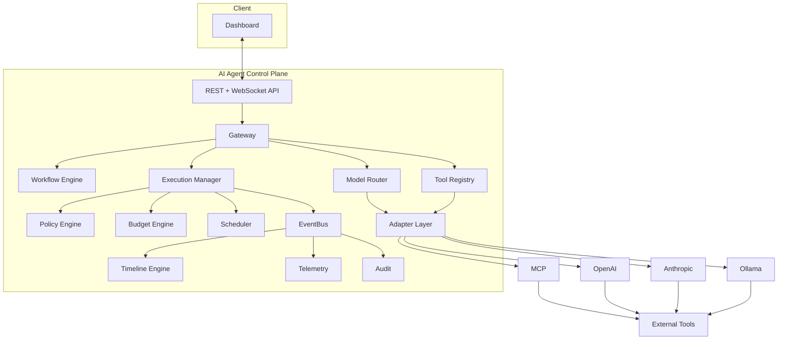
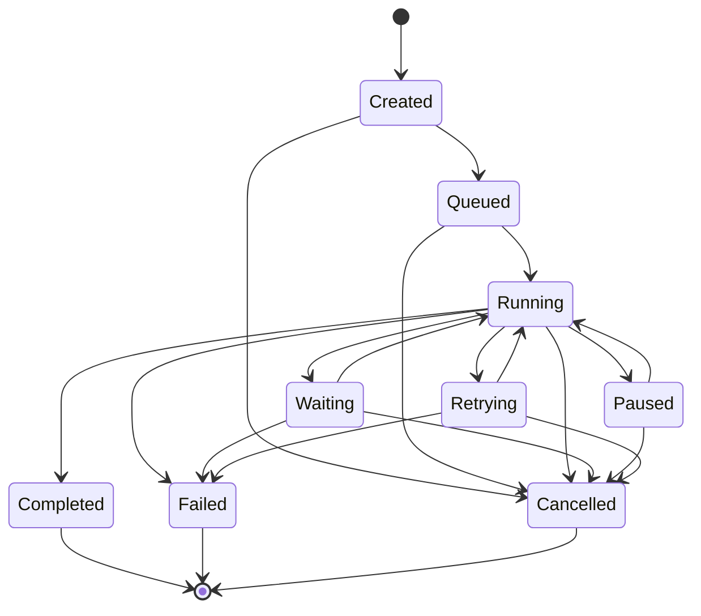

# Architecture

## High-level shape

This mirrors the spec's box diagram directly; nothing here is a design
change, just a precise rendering so package boundaries can be checked
against it.

## Package-boundary decisions made during scaffolding

The spec left a few boundaries implicit. These are the calls made to
unblock Milestone 1 — flag any of them if they don't match intent, they're
cheap to change now and expensive after Milestone 5:

- **Gateway vs. Adapter Layer**: `internal/gateway` is the ingress
  boundary — inbound protocol termination, authn/authz, rate limiting —
  and calls into `internal/adapters` for provider-specific translation.
  `internal/adapters` never terminates a request itself.
- **Event store vs. message bus**: NATS (JetStream) is fan-out/delivery
  only (pub/sub to WebSocket subscribers, cross-instance coordination).
  PostgreSQL is the source of truth for the event log; anything durable
  (audit, replay) reads from Postgres, never from NATS.
- **Storage package split**: repository *interfaces* live next to the
  domain package that owns the aggregate (e.g. `internal/execution`
  defines `ExecutionRepository`). `internal/storage` holds only the
  Postgres implementations, added in Milestone 7. Earlier milestones
  develop against in-memory implementations of the same interfaces.
- **Dependency injection**: no DI framework. `internal/app` is a single
  composition root using constructor injection — see `internal/app/app.go`.
  Domain packages depend on nothing in `internal/app`; `internal/app`
  depends on all of them. This keeps domain logic unit-testable without
  a DI container and keeps "what gets wired where" in one file.
- **Config**: environment-variable driven (`internal/config`), no
  framework, since the non-functional requirement asks for env-var
  config and nothing more sophisticated is needed yet.

## Deferred to later milestones (see each package's doc comment)

Gateway, Policy evaluator, Budget tracking, Event envelope/bus, Timeline
projection, Model Router, and all provider adapters are still empty
packages with a documented responsibility and target milestone — see
the package comment at the top of each `internal/*` package's main file.
Execution and Workflow (below) are no longer in that category.

## Milestone 2 — core domain model and state machine

`internal/workflow` and `internal/execution` are implemented. Key
decisions made to unblock this milestone, resolving two of the open
questions below:

- **Workflow definition format** (was open question #4): canonical
  in-memory representation is the `Workflow`/`Step` Go structs, with
  `json` tags for API request/response bodies. YAML is left as a thin
  conversion layer to add later (unmarshal YAML → JSON → the same
  struct) rather than a distinct format designed around now — this
  keeps the REST API (Milestone 5) trivial and doesn't invent a DSL
  before there's evidence one is needed.
- **Make illegal states unrepresentable**: `workflow.New` fully
  validates the step graph (unique IDs, resolvable dependencies, no
  cycles — detected via Kahn's algorithm) and caches a topological
  order at construction time. There is no separate `Validate()` a
  caller can forget to call; a `Workflow` value cannot exist in an
  invalid state.
- **Execution aggregate stays narrow**: `Execution` owns exactly
  lifecycle `State` and per-step `StepRun` progress. Budget ledger
  entries, policy decisions, and events reference an execution ID from
  their own owning packages rather than being embedded as fields here —
  "everything belongs to an execution" is a relationship, not a struct
  embedding. This avoids guessing at shapes (`internal/budget`,
  `internal/policy`, `internal/events`) that don't exist yet.
- **Repository pattern, in-memory today**: both packages define a
  `Repository` interface plus an `InMemoryRepository`, per the
  Milestone 1 decision that repository interfaces live next to their
  domain package and the Postgres implementation is a Milestone 7
  swap-in. `execution.InMemoryRepository` deliberately returns/stores
  **clones** (`Execution.Clone()`) rather than shared pointers, so code
  written against it can't rely on aliasing that won't hold once
  Milestone 7 swaps in Postgres — `Get()` gives you a snapshot; only
  `Update()` persists a change. This is the resolution (for the
  in-memory case) of open question #3 below on write concurrency: it
  doesn't provide cross-instance concurrency control, but it does
  enforce the same "read a copy, write explicitly" discipline the real
  implementation will need, so calling code is already written correctly
  against it.

### Execution state machine

The spec's own diagram renders the nine states as a single straight
line (`Retrying -> Completed -> Failed -> Cancelled`), which taken
literally would mean every execution retries, then completes, then
fails, then gets cancelled. Read in context it's clearly just an
enumeration of the state names, not a transition graph. The actual
graph implemented in `internal/execution/state.go`:

Nothing generates this diagram from the code (or vice versa) — keep
them in sync by hand if the graph changes; `state.go`'s `transitions`
map is the authoritative source. `Completed`, `Failed`, and `Cancelled`
are terminal: `Execution.Transition` rejects any further transition
once one of those is reached, regardless of target.

Step-level progress (`StepRun.Status`) is intentionally a lighter
model: pending/running/waiting/completed/failed/skipped with only a
single rule enforced (a terminal step can't be modified further). It
does not have its own transition graph, and it does not decide *which*
step runs next based on the Workflow's dependency graph — that
ordering/dispatch logic belongs to the Scheduler / Execution Manager
(Milestone 5+), not to this aggregate.

## Milestone 3 — event bus and timeline engine

`internal/events` and `internal/timeline` are implemented. Key
decisions:

- **Store vs. Bus, as code**: this is the Milestone 1 architectural
  call (NATS = fan-out, Postgres = source of truth) made concrete.
  `events.Store` is the durable, replayable log (`InMemoryStore` today,
  Postgres in Milestone 7); `events.Bus` is best-effort live fan-out
  (`InMemoryBus` today — single-process pub/sub over channels, a slow
  subscriber gets dropped events rather than blocking the publisher). A
  NATS-backed `Bus` is deferred until something actually needs
  cross-instance delivery (multiple server replicas serving WebSocket
  subscribers) — the interface doesn't change either way.
- **`Recorder` ties them together**: producers (the not-yet-built
  Execution Manager, Policy Engine, Budget Engine) will depend on
  `events.Recorder.Record`, not wire `Store`+`Bus` separately. It
  appends first (durable), then publishes the exact stored copy —
  Sequence included — so a live subscriber and a later replay agree on
  ordering for the same event.
- **Sequence, not wall-clock time, defines order**: `Store.Append`
  assigns a `Sequence` monotonically per `ExecutionID`. Timestamps can
  collide or skew across processes; `timeline.Sort`/`Build` order by
  `Sequence`, never by `OccurredAt`.
- **Timeline stays decoupled from Execution/Workflow**: `internal/
  timeline` only imports `internal/events`. Human-readable labels (step
  name, tool name, policy name) travel in the event's own `Data`
  payload via well-known keys (`events.DataKeyStepName` etc.) rather
  than the timeline renderer reaching into a `Workflow` to look one up.
  This keeps rendering pure and trivially testable, at the cost of
  requiring producers to remember to populate those keys — worth
  revisiting if that turns out to be a common mistake once producers
  exist.
- **Replay semantics — resolved** (was open question #1): `timeline.
  Build` is a pure function over `events.Store.List`'s output, so
  calling it again on the same stored events reproduces an identical
  timeline. That *is* this milestone's implementation of "replay the
  execution timeline" — the safe, read-only sense. Re-executing a
  completed execution's side-effecting steps from some point (the
  other reading of "replay") is a different capability, is not what
  this implements, and remains explicitly out of scope until a later
  milestone deliberately designs for it (with the idempotency
  safeguards open question #2 below still describes).
- No HTTP/WebSocket exposure was added — `/events` and `/timeline`
  streaming endpoints are Gateway's job (Milestone 5), same scope
  discipline as Milestone 2 not adding REST routes for Execution/
  Workflow.

## Milestone 4 — budget engine and native policy engine

`internal/budget` and `internal/policy` are implemented. Budget was
folded into this milestone rather than left without a home — the
original plan named it as a Phase 1 deliverable but never gave it a
milestone slot, and Policy is specified to reference budget state, so
Budget had to exist first regardless.

- **The "Agent" gap, made explicit rather than silently worked around**:
  the spec's Domain Model section names Agent as a core concept ("owns
  credentials, policies, budgets, allowed tools") but the spec's own
  repository layout never lists an `internal/agent` package. Rather
  than invent a new top-level package the spec didn't ask for, or quietly
  ignore the concept, Budget and Policy both take a plain opaque
  `OwnerID`/`AgentID` string. This unblocks both packages today without
  guessing at what a full Agent aggregate (registration, credential
  storage, tool allowlists as data rather than passed-in config) should
  look like — that's Milestone 5's job, once Gateway needs agents to
  actually authenticate. Concretely, `policy.ToolAllowlistRule` takes a
  `map[string][]string` of agent ID → allowed tools as constructor
  config today; a real Agent registry would supply that same data
  later. **This means the spec's Phase 1 success criterion "Register an
  agent and its permissions" is still not implemented** — tracked
  explicitly rather than left to be discovered missing at the end.
- **Budget decides nothing, Policy decides everything**: `budget.Ledger`
  only tracks and reports (`Usage`, `Limit`, `Exceeded()`); whether an
  exceeded budget should deny an action is `policy.BudgetRule`'s job.
  This is the same boundary Milestone 2 drew around `Execution` (owns
  state, not decisions about that state).
- **Policy reads budget state through plain values, not a live
  pointer**: `policy.Input` carries `budget.Limit`/`budget.Usage`/`bool`
  fields, not a `*budget.Ledger`. A `Rule` could call `Ledger.Charge()`
  if handed the live aggregate — passing snapshotted values enforces
  "policy only reads budget" at the type level instead of by convention.
- **Deny-overrides evaluation, not first-match-wins**: `NativeEngine`
  evaluates every rule; any explicit deny wins immediately regardless of
  registration order, an explicit allow wins only if nothing denies, and
  the configured default effect applies if no rule has an opinion. This
  is the same model AWS IAM's explicit-deny and Kubernetes admission
  webhooks use, and it avoids a subtle bug class where an early
  permissive rule accidentally shadows a later, stricter one.
- **Four concrete rules ship**: `BudgetRule`, `ToolAllowlistRule`,
  `AllowedModelsRule`, `TimeWindowRule` — covering budget/agent/tool,
  provider/model, and time from the spec's named dimensions concretely.
  Workflow, execution, and environment are already present as
  `policy.Input` fields (plus an `Extra map[string]any` escape hatch)
  for a future rule to match on; there's no rule for them yet simply
  because nothing produces a meaningful policy for them today, not
  because the engine can't support it. "User role" is explicitly
  deferred in the spec itself.
- **The OPA/Cedar swap point is the `Engine` interface**:
  `policy.Engine` has one method, `Evaluate(ctx, Input) (Decision,
  error)`. `NativeEngine` is the only implementation today; a
  Rego/Cedar-backed one is additive later, same pattern as `Store`/`Bus`
  in Milestone 3 and `Repository` throughout.
- Same scope discipline as Milestones 2–3: no dependency on
  `internal/execution` or `internal/events` from either new package
  (verified: `internal/policy` imports only `internal/budget`;
  `internal/budget` imports no other `internal/*` package), and no HTTP
  exposure — a stored, named, enable/disable-able Policy record (the
  dashboard's "Policies: View, Enable, Disable, Test") is Milestone 5's
  job, layered on top of the `Rule`/`Engine` primitives built here.

## Milestone 5 — Gateway and protocol adapters

`internal/agent`, `internal/adapters` (+ `mcp`, `openai` subpackages),
and `internal/gateway` are implemented. This is the milestone where
every previously-isolated package finally gets composed — Workflow,
Execution, Events, Policy, Budget, and the new Adapters all get wired
together by `gateway.Service`, and the server gets its first real HTTP
surface.

- **Agent gets its package, resolving open question #6**: `internal/agent`
  is a new top-level package (not folded into `internal/auth` or
  `internal/gateway`) — the same reasoning that gave Workflow and
  Execution their own packages despite being referenced elsewhere.
  `internal/auth` remains reserved for control-plane-*operator*
  authN/authZ, a different concern from Agent-as-workload-identity.
  Only a salted hash of an issued bearer token is ever stored; the
  plaintext is returned exactly once, at registration.
- **`gateway.Service` is the spec's "Execution Manager"**: it's the
  first thing in this codebase allowed to import and compose
  `execution`, `workflow`, `events`, `policy`, `budget`, and `adapters`
  together — every one of those packages was kept deliberately
  ignorant of the others across Milestones 2-4 specifically so this
  composition would be possible without touching any of them. Its
  `run`/`runStep` driver is intentionally synchronous and sequential
  (`Workflow.TopologicalOrder()`, one step at a time, stop-on-first-
  failure) rather than the concurrent, backoff-and-retry-aware dispatch
  a real Scheduler would do — this proves the full wiring end-to-end;
  making it concurrent/resilient is additive future work, not a
  rewrite.
- **Adapters split by shape, not spec's list**: `adapters.Adapter`
  (tool calls) and `adapters.ModelAdapter` (model/chat calls) are two
  interfaces, not one — MCP is fundamentally about tool/resource
  invocation, OpenAI about chat completions, and forcing both into one
  interface would mean awkward unused fields either way.
- **MCP adapter is a real (if intentionally minimal) client**: it
  speaks actual JSON-RPC 2.0 over MCP's Streamable HTTP transport for
  `tools/call`, tested against an `httptest` server that speaks the
  same subset. What's missing relative to the full spec — initialize
  handshake, capability negotiation, `tools/list` discovery, SSE
  streaming, sessions — is a deliberate scope cut documented in the
  package itself, not a hidden gap.
- **OpenAI adapter makes real HTTP calls** to the Chat Completions
  endpoint (`net/http` directly, no SDK dependency) — single-turn,
  non-streaming, no function-calling. Tested against `httptest`, never
  the live API.
- **Policy reconciles a spec inconsistency**: the spec's one worked
  event-chain example says the event after `PolicyEvaluated` is
  `ToolApproved`, but its general event list says `PolicyApproved`.
  Milestone 3 had already standardized on `PolicyApproved`/
  `PolicyDenied` (they apply to model-call steps too, not just tool
  calls) — `gateway.Service` uses that pair, documented at the call
  site so the discrepancy isn't a silent surprise later.
- **No admin API for policy rules yet**: `internal/app` wires a
  `NativeEngine` with zero rules and `EffectAllow` as the default —
  the only honest choice until there's a way to configure real ones.
  Flagged explicitly (including in a code comment at the wiring site):
  a real deployment MUST configure real rules before this default
  matters. Building the stored, named, enable/disable-able Policy
  records the dashboard needs (Milestone 6) is what closes this gap.
- **Rate limiting**: Redis-backed fixed-window (`INCR`+`EXPIRE`),
  keyed by authenticated agent ID or source IP. Fails open on a Redis
  error — an unreachable limiter should degrade to unlimited, not take
  the API down; `/readyz` is where a Redis outage is supposed to
  surface, not request-time 500s.
- **WebSocket streaming has no history for late subscribers**: `GET
  .../executions/{id}/ws` streams live events from `events.Bus` only —
  Bus was deliberately built with no replay capability in Milestone 3.
  A client that needs full history should `GET .../events` first, then
  open the socket for what happens next; merging the two into one
  gapless stream is a real problem, left unsolved rather than partially
  solved here.
- **Agent registration is unauthenticated** — bootstrapping the very
  first agent would otherwise be circular, and there's no
  control-plane-operator auth (`internal/auth`) yet to gate it with.
  This is a known, flagged security gap for any deployment beyond local
  development, not an oversight.
- **Verified against a real running server**, not just unit tests:
  registered an agent, registered a workflow, started an execution, and
  watched it reach `completed` with the exact event chain from the
  spec's own example (`Execution Created → Started → StepStarted →
  PolicyEvaluated → PolicyApproved → StepCompleted → Execution
  Completed`) — over real HTTP, against real Postgres/Redis/NATS.

## Milestone 7 — persistence and production hardening

Reordered ahead of Milestone 6 (Dashboard) — a dashboard needs real
data to visualize, and until this milestone every execution/workflow/
agent vanished on process restart. `internal/storage` now implements
every domain package's `Repository` interface (plus `events.Store`)
against Postgres; `internal/app` wires them in as the default.

- **Reconstitution APIs, the gap flagged back in Milestone 2**:
  `workflow.Restore`, `execution.Restore`, and `agent.Restore` were
  added so a row loaded from Postgres can become a domain object
  without going through each package's "fresh creation" constructor
  (which stamps `CreatedAt`/generates a token/starts at
  `StateCreated` — none of which is right for data coming back out of
  the database). `budget.Ledger` didn't need one: `New` +
  `Charge(persistedUsage)` reconstructs it exactly, since a Ledger has
  no generated/hidden fields the way Workflow (timestamp), Execution
  (multiple derived fields), and Agent (token) do. `Restore` still runs
  the same structural validation `New` does where that's cheap
  (Workflow, Execution's enum checks) — defense against corrupted
  persisted data, not just a trust-the-caller shortcut.
- **Schema**: mostly one table per aggregate with real columns for
  anything queried on (id/version/workflow_id/state/token_hash), JSONB
  for the rest (steps, metadata, history, step-run map, event data).
  `execution_sequences` is a dedicated counter table — `INSERT ... ON
  CONFLICT DO UPDATE ... RETURNING next_seq` in one statement is the
  standard correct pattern for a gap-free per-key counter under
  concurrent Postgres writers, verified with an actual concurrency
  test (50 goroutines appending to the same execution, asserting a
  complete gapless 1..50 sequence), not just asserted.
- **Migrations run on every boot** (`storage.Migrate`, embedded SQL
  files via `go:embed`, `golang-migrate`) — idempotent, so this is safe
  to call unconditionally rather than requiring a separate deploy step.
  Also exposed as `control-planectl migrate up` for an operator (or a
  deploy pipeline / k8s init container) to run independently. Failure
  is logged, not fatal — same posture as the Postgres/Redis/NATS
  connection attempts in Milestone 1: a database that's merely slow to
  become available shouldn't crash-loop the whole process, and
  `/readyz` already reports the underlying connectivity problem.
- **Verified against a real restart, not just integration tests**: ran
  the actual server, registered an agent/workflow/execution over real
  HTTP, killed the process, started a *completely new* process, and
  confirmed the agent (including its bearer token still authenticating
  — the hash persisted, not just the record), workflow, execution, and
  full event timeline were all exactly as left. This is the concrete
  meaning of "persistence" for this milestone, not just "the repository
  interface has a Postgres implementation."
- **Bus stays in-memory** — only `events.Store` (durability) moved to
  Postgres. A NATS-backed `Bus` remains explicitly deferred (see
  Milestone 3/5 notes): nothing in this codebase yet needs
  cross-instance live event fan-out, since there's no multi-replica
  deployment story.
- **Integration tests are real, not mocked**, gated behind
  `TEST_DATABASE_URL` (skip, not fail, when unset) so `go test ./...`
  stays hermetic by default. CI provisions a Postgres service container
  for a dedicated integration job. Verified repeatable by running the
  suite twice in a row against the same persistent database — the
  first attempt at this exposed a real test-design bug (per-test
  unique IDs guarded against collisions *within* one run but not
  *across* runs against a non-ephemeral database), fixed with a
  `TestMain` that truncates once per test-binary execution rather than
  relying on a fresh database every time.
- **A pre-existing latent bug, found and fixed while here**:
  `golangci-lint` v1.62.2 — pinned in the Makefile and CI since
  Milestone 1 — doesn't support the Go 1.26 toolchain `go.mod`
  declares; only local ad hoc `go install` workarounds in this session
  had actually been using a working version. Both the Makefile and CI
  now pin v2.12.2 installed via `go install`/`install-mode: goinstall`,
  consistent with what's actually been verified working throughout
  this project.
- **Production hardening, modestly**: request bodies are capped at 1
  MiB (`http.MaxBytesReader`) — generous headroom for the largest
  legitimate body (a Workflow definition) while bounding an
  accidentally-or-maliciously huge request. Not an exhaustive hardening
  pass — see open questions below for what's still missing.

## Milestone 6 — dashboard

Run after Milestone 7 per that milestone's own reordering rationale — a
dashboard needs real, persistent data to point at, and now it has some.
`apps/dashboard` is a Next.js/React/TypeScript app rendering exactly
what the REST/WebSocket API (Milestones 3–5, persisted since Milestone
7) already exposes: Overview, Agents, Workflows (+ step-graph detail),
Executions (+ live detail: step graph, timeline, raw events, budget),
Settings. See `apps/dashboard/README.md` for the full stack table,
what's cut and why, and local-dev instructions — this section covers
only the decisions and backend changes that reach outside that
directory.

- **Two small, real backend changes were needed, not zero.** A
  frontend milestone that required no backend change at all would mean
  the backend was already a complete API for a browser client, which
  it wasn't:
  - **CORS.** Nothing before this needed it — every prior milestone's
    "real HTTP verification" used curl or a Go test, never a browser
    enforcing same-origin policy. `internal/app` now mounts
    `github.com/go-chi/cors`, configured via a new
    `CORS_ALLOWED_ORIGINS` env var (`config.Config.CORSAllowedOrigins`,
    default `*`) — permissive by default for local development, same
    posture as the policy engine's default-allow, same posture as the
    open item that a real deployment must configure a real value.
  - **`GET .../executions/{id}/budget`.** `events.BudgetUpdated` only
    carries the delta charged (`DataKeyTokenDelta`), not a running
    total — rendering "how much of this execution's budget is used"
    needs the `budget.Ledger` itself, which nothing exposed over HTTP
    before now. `gateway.Service.GetExecutionBudget` reuses the same
    `Budgets.GetOrCreate` call `chargeBudget` already makes (seeding a
    zero-usage ledger for an execution that never charged anything is
    the right answer for a read, not an error) rather than adding a
    `Get`-only method to `budget.Repository`.
- **`events.Event` and `timeline.Entry` gained JSON tags.** Both have
  been HTTP response bodies since Milestone 5, but neither ever had a
  test or caller that decoded the JSON back into a typed struct, so
  nobody had noticed `encoding/json`'s no-tags-present fallback was
  shipping `PascalCase` field names (`ExecutionID`, `OccurredAt`) —
  inconsistent with every other response body in this API
  (`workflow.Step`, `agentView`, `executionView`: all snake_case).
  Fixed now because the dashboard is the first typed consumer; this is
  a wire-format change with no Go-level behavior change; no test
  anywhere asserted the old casing.
- **The WebSocket route needed its own auth exception.**
  `AuthMiddleware` (every other route) reads the token from the
  `Authorization` header only. Browsers cannot set arbitrary headers
  during a WebSocket handshake, so `GET .../executions/{id}/ws` would
  have been uncallable from a browser at all under that scheme. Rather
  than relax the header-only rule for every route, `internal/gateway/
  auth.go` adds `AuthMiddlewareWS`, mounted only on the WS route: it
  accepts the header if present, and falls back to a `?token=` query
  parameter only for this one endpoint. Query parameters can leak into
  server access logs or a `Referer` header in ways a header doesn't —
  a real, accepted trade-off for the one route that structurally
  cannot avoid it, not a general auth-scheme relaxation. Locked in by
  `TestWS_AcceptsTokenViaQueryParam` and `TestWS_RejectsMissingToken`.
- **Component library: hand-rolled, not shadcn-CLI-vendored.** The
  spec names shadcn/ui; the CLI's actual mechanism is generating
  component source into the repo from a hosted registry. For the
  handful of primitives this dashboard needs (`Button`, `Card`,
  `Table`, `Badge`, `Input`, `Select`, plus real `@radix-ui/react-dialog`
  and `-tabs` underneath `Dialog`/`Tabs` for genuine accessible
  behavior), hand-rolling against the same design tokens
  (`--background`, `--card`, `--primary`, ...) gets the same visual
  language without that indirection. `apps/dashboard/README.md`'s
  stack table has the full reasoning per package.
- **Per-step execution status is derived client-side, not added to the
  API.** `executionView` (Milestone 5) deliberately hand-picks fields
  rather than exposing `execution.Execution`'s internal `Steps` map.
  Every status transition the dashboard needs is already a distinct,
  durably recorded event carrying `step_id`
  (`StepStarted`/`StepCompleted`/`StepFailed` — see
  `gateway.Service.runStep`/`failStep`), so `lib/step-status.ts`
  projects it from `GET .../events` — the same "replay is a pure
  projection over the event stream" principle `internal/timeline.Build`
  already relies on, just implemented in TypeScript instead of Go
  because this projection has no other consumer.
- **Live updates are poll-plus-invalidate, not a hand-merged event
  stream.** The dashboard's WebSocket hook (`hooks/use-api.ts`'s
  `useExecutionSocket`) doesn't append incoming events into the
  TanStack Query cache; it invalidates the timeline/events/budget/
  execution queries so they refetch from `GET .../events` — which
  remains the single source of truth the dashboard reads from. This
  costs a small amount of redundant network traffic in exchange for
  never having two different representations of the same event to
  reconcile. Execution/list views also poll every 2s regardless of the
  socket, since `events.Bus` (Milestone 3) has no history for a late
  subscriber and an execution's step-driver runs in a background
  goroutine with no other push signal.
- **Cut, deliberately, not silently:** Policies, Tool Registry, and
  Model Router pages don't exist — there's no admin API yet for any of
  those (open question #7 below), and a page that can't persist
  anything would be a mockup, not a feature. Workflow authoring is a
  JSON textarea (still fully validated server-side via
  `workflow.Workflow.UnmarshalJSON`), not a visual step builder. The
  DAG visualization (`@xyflow/react`) uses a simple longest-path
  layered layout, not a general graph-drawing algorithm.
- **Verified against the real running stack**, not just `next build`:
  registered an agent, workflow, and execution through the live Go
  server via curl, confirmed the dashboard's dev server serves every
  route at 200 against that same data, and separately confirmed the
  WebSocket's new query-token auth path with a real client (both a Go
  test and a standalone Python `websockets` connection against the
  live server) rather than trusting the unit test alone.

## Open questions carried over from spec review

Updated after Milestone 6 — the rest are unchanged except where noted:

1. ~~Replay semantics~~ — resolved in Milestone 3.
2. **Tool-call idempotency** — still unresolved. Adapters make real
   calls (Milestone 5) and events durably persist (Milestone 7), so
   this is blocked on nothing but design effort. A retried step can
   still double-execute a side-effecting tool call today.
3. **Execution-write concurrency, distributed case — still open even
   with Postgres landed.** `storage.ExecutionRepository.Update` is a
   plain `UPDATE ... WHERE id = $1` with no version/CAS check — two
   server instances racing to update the same execution can still
   silently clobber each other's write. This was flagged as optional
   in Milestone 2's `Repository` doc comment (adding a version check
   later is backward compatible) and deliberately not added now to
   keep this milestone's scope to "persistence exists and is correct
   for a single writer," not "distributed-safe." Needed before running
   more than one server instance against the same database.
4. ~~Workflow definition format~~ — resolved in Milestone 2.
5. **Approval routing** — still undefined; `StepTypeApproval` still
   completes as a no-op in `gateway.Service.runStep`.
6. ~~Agent identity/registration~~ — resolved in Milestone 5. Full
   credential lifecycle (rotation, revocation, Vault/KMS) and agent
   registration being unauthenticated remain open — both need
   `internal/auth`, still unbuilt.
7. **No stored/configurable Policy records** — still unchanged, and now
   without a milestone to attach it to: Milestone 6 built the dashboard
   against exactly the admin surface that existed (none), rather than
   inventing a Policy management API to give it something to render
   (see Milestone 6's "cut, deliberately" note) — a Policies page over
   state the backend can't persist would have been a mockup. Still
   arguably the most consequential remaining gap for anything beyond
   local development; the natural next milestone is building that API
   and the dashboard page for it together.
8. **NATS-backed `events.Bus`** — still in-memory only; needed once a
   multi-replica deployment requires cross-instance live event
   delivery. Not needed for anything this codebase does today.
9. **`CORS_ALLOWED_ORIGINS` defaults to `*`** (Milestone 6) — same
   posture as the policy engine's default-allow and Milestone 7's 1 MiB
   body cap: a deliberate, flagged local-development default, not a
   production-ready one. A real deployment must set this to the actual
   dashboard origin(s) before exposing this API beyond localhost.
